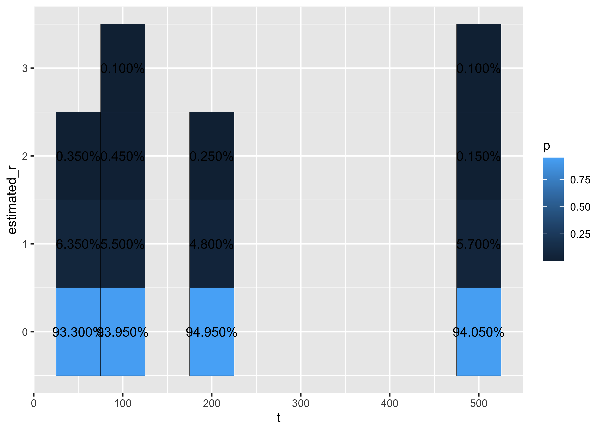
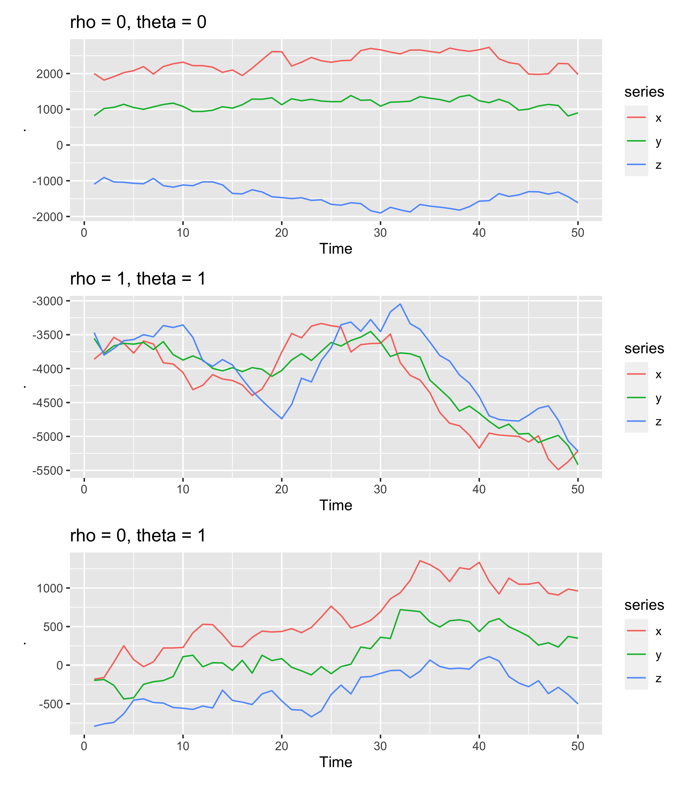

Results
================

``` r
library(tidyverse)
library(tsDyn)
library(patchwork)
source("codes/utils.R")
source("codes/dgp_functions.R")
load("data/estimated_rank.RData")
```

``` r
estimated_rank_df %>% 
  filter(nominal_size == .05) %>% 
  filter(n == 3 & r == 0) %>% 
  count(t, estimated_r, name = "p") %>% 
  group_by(t) %>% 
  mutate(p = p / sum(p)) %>% 
  ggplot(aes(t, estimated_r, fill = p)) + 
  geom_tile(color = "black") + 
  geom_text(aes(label = scales::percent(p)))
```

<!-- -->

Reject rate!

``` r
estimated_rank_df %>% 
  filter(r == 0) %>% 
  count(n, nominal_size, t, estimated_r, name = "estim_count") %>% 
  crossing(r = 0:3) %>% 
  filter(n > r & estimated_r > r) %>% 
  group_by(n, nominal_size, t, r) %>% 
  summarise(value = sum(estim_count) / 2000) %>% 
  arrange(desc(nominal_size)) %>% # wider in same order as in the paper
  pivot_wider(names_from = nominal_size, names_prefix = "Nominal size = ", values_fill = 0) %>% 
  select(n, t, r, everything()) %>% 
  arrange(n, t, -r) %>% 
  mutate_at(-(1:3), ~ scales::percent(., accuracy = .01)) %>% 
  knitr::kable(caption = "podivinszky_tbl1", align = rep("c", 10))
```

    ## `summarise()` has grouped output by 'n', 'nominal_size', 't'. You can override
    ## using the `.groups` argument.

|  n  |  t  |  r  | Nominal size = 0.5 | Nominal size = 0.1 | Nominal size = 0.05 | Nominal size = 0.025 |
|:---:|:---:|:---:|:------------------:|:------------------:|:-------------------:|:--------------------:|
|  2  | 50  |  1  |       24.50%       |       1.50%        |        0.55%        |        0.05%         |
|  2  | 50  |  0  |       52.45%       |       10.15%       |        5.95%        |        2.80%         |
|  2  | 100 |  1  |       26.00%       |       1.30%        |        0.75%        |        0.05%         |
|  2  | 100 |  0  |       49.50%       |       10.45%       |        5.60%        |        2.65%         |
|  2  | 200 |  1  |       26.05%       |       1.75%        |        0.45%        |        0.30%         |
|  2  | 200 |  0  |       50.30%       |       10.60%       |        4.95%        |        2.95%         |
|  2  | 500 |  1  |       24.70%       |       1.15%        |        0.40%        |        0.05%         |
|  2  | 500 |  0  |       50.45%       |       9.20%        |        4.75%        |        2.40%         |
|  3  | 50  |  2  |       14.10%       |       0.55%        |        0.00%        |        0.05%         |
|  3  | 50  |  1  |       28.40%       |       1.55%        |        0.35%        |        0.15%         |
|  3  | 50  |  0  |       55.00%       |       10.25%       |        6.70%        |        3.70%         |
|  3  | 100 |  2  |       14.55%       |       0.25%        |        0.10%        |        0.00%         |
|  3  | 100 |  1  |       27.20%       |       1.40%        |        0.55%        |        0.00%         |
|  3  | 100 |  0  |       52.00%       |       9.90%        |        6.05%        |        2.95%         |
|  3  | 200 |  2  |       12.80%       |       0.35%        |        0.00%        |        0.05%         |
|  3  | 200 |  1  |       25.90%       |       1.60%        |        0.25%        |        0.40%         |
|  3  | 200 |  0  |       49.25%       |       10.85%       |        5.05%        |        3.15%         |
|  3  | 500 |  2  |       13.70%       |       0.30%        |        0.10%        |        0.05%         |
|  3  | 500 |  1  |       26.90%       |       1.55%        |        0.25%        |        0.15%         |
|  3  | 500 |  0  |       50.25%       |       9.95%        |        5.95%        |        2.45%         |

podivinszky_tbl1

``` r
estimated_rank_df %>% 
  filter(t %in% c(50, 100) & nominal_size == .05) %>%
  rename(true_r = r) %>% 
  crossing(r = 0:2) %>% 
  filter(n > r & estimated_r > r) %>% 
  count(n, true_r, t, r, estimated_r, name = "estim_count") %>% 
  group_by(n, true_r, t, r) %>% 
  summarise(value = sum(estim_count) / 2000) %>% 
  pivot_wider(names_from = t, values_from = value, names_prefix = "T = ", values_fill = 0) %>% 
  mutate(across(starts_with("T "), scales::percent, accuracy = .01)) %>% 
  arrange(n, true_r, -r) %>% 
  knitr::kable(align = rep("c", 10), caption = "podivinszky_tbl2 2 és 3 idősoron futók csak")
```

    ## `summarise()` has grouped output by 'n', 'true_r', 't'. You can override using
    ## the `.groups` argument.

|  n  | true_r |  r  | T = 50 | T = 100 |
|:---:|:------:|:---:|:------:|:-------:|
|  2  |   0    |  1  | 0.05%  |  0.05%  |
|  2  |   0    |  0  | 0.10%  |  0.10%  |
|  2  |   1    |  1  | 0.05%  |  0.05%  |
|  2  |   1    |  0  | 0.10%  |  0.10%  |
|  3  |   0    |  2  | 0.00%  |  0.05%  |
|  3  |   0    |  1  | 0.05%  |  0.10%  |
|  3  |   0    |  0  | 0.10%  |  0.15%  |
|  3  |   1    |  2  | 0.05%  |  0.05%  |
|  3  |   1    |  1  | 0.10%  |  0.10%  |
|  3  |   1    |  0  | 0.15%  |  0.15%  |
|  3  |   2    |  2  | 0.05%  |  0.05%  |
|  3  |   2    |  1  | 0.10%  |  0.10%  |
|  3  |   2    |  0  | 0.15%  |  0.15%  |

podivinszky_tbl2 2 és 3 idősoron futók csak

# Podivinszky dgp

``` r
load("data/podivinszky_estimate.RData")
```

## Figure for DGPs

``` r
set.seed(1)

(podivinszky_dgp(rho = 0, theta = 0) %>% 
    ts() %>% 
    autoplot() + ggtitle("rho = 0, theta = 0")) /
  (podivinszky_dgp(rho = 1, theta = 1) %>% 
     ts() %>% 
     autoplot() + ggtitle("rho = 1, theta = 1") )/
  (podivinszky_dgp(rho = 0, theta = 1) %>% 
     ts() %>% 
     autoplot() + ggtitle("rho = 0, theta = 1"))
```

<!-- -->

## Reproduce table 2

### Test on 3 variables

``` r
podivinszky_estimate_df %>% 
  count(t, rho, theta, xyz_r, name = "estim_count") %>% 
  crossing(r = 0:2) %>% 
  filter(xyz_r > r) %>% 
  group_by(t, rho, theta, r) %>% 
  summarise(value = sum(estim_count) / 2000) %>% 
  pivot_wider(names_from = t, names_prefix = "T = ") %>% 
  arrange(rho, theta, -r) %>% 
  knitr::kable(caption = "Podivinszky tbl2 - reject rates", align = rep("c", 6))
```

    ## `summarise()` has grouped output by 't', 'rho', 'theta'. You can override using
    ## the `.groups` argument.

| rho | theta |  r  | T = 50 | T = 100 | T = 500 |
|:---:|:-----:|:---:|:------:|:-------:|:-------:|
|  0  |   0   |  2  | 0.0070 | 0.0050  | 0.0055  |
|  0  |   0   |  1  | 0.0600 | 0.0515  | 0.0460  |
|  0  |   0   |  0  | 0.9995 | 1.0000  | 1.0000  |
|  0  |   1   |  2  | 0.0095 | 0.0075  | 0.0045  |
|  0  |   1   |  1  | 0.0730 | 0.0540  | 0.0540  |
|  0  |   1   |  0  | 1.0000 | 1.0000  | 1.0000  |
|  1  |   1   |  2  | 0.0895 | 0.0725  | 0.0625  |
|  1  |   1   |  1  | 1.0000 | 1.0000  | 1.0000  |
|  1  |   1   |  0  | 1.0000 | 1.0000  | 1.0000  |

Podivinszky tbl2 - reject rates

### Test on 2 variables (x, y)

``` r
podivinszky_estimate_df %>% 
  count(t, rho, theta, xy_r, name = "estim_count") %>% 
  crossing(r = 0:1) %>% 
  filter(xy_r > r) %>% 
  group_by(t, rho, theta, r) %>% 
  summarise(value = sum(estim_count) / 2000) %>% 
  pivot_wider(names_from = t, names_prefix = "T = ") %>% 
  arrange(rho, theta, -r) %>% 
  knitr::kable(caption = "Podivinszky tbl2 - reject rates", align = rep("c", 6))
```

    ## `summarise()` has grouped output by 't', 'rho', 'theta'. You can override using
    ## the `.groups` argument.

| rho | theta |  r  | T = 50 | T = 100 | T = 500 |
|:---:|:-----:|:---:|:------:|:-------:|:-------:|
|  0  |   0   |  1  | 0.0570 | 0.0525  | 0.0585  |
|  0  |   0   |  0  | 1.0000 | 1.0000  | 1.0000  |
|  0  |   1   |  1  | 0.0270 | 0.0275  | 0.0375  |
|  0  |   1   |  0  | 0.5120 | 0.5885  | 0.6780  |
|  1  |   1   |  1  | 0.2335 | 0.2225  | 0.1615  |
|  1  |   1   |  0  | 0.9875 | 1.0000  | 1.0000  |

Podivinszky tbl2 - reject rates

# Podivinszky no wp

``` r
load("data/podivinszky_no_wp_estimate.RData")
```

## Reproduce table 2

### Test on 3 variables

``` r
podivinszky_no_wp_estimate %>% 
  filter(t %in% c(50, 100)) %>% 
  count(t, rho, theta, xyz_r, name = "estim_count") %>% 
  crossing(r = 0:2) %>% 
  filter(xyz_r > r) %>% 
  group_by(t, rho, theta, r) %>% 
  summarise(value = sum(estim_count) / 2000) %>% 
  pivot_wider(names_from = t, names_prefix = "T = ") %>% 
  arrange(rho, theta, -r) %>% 
  mutate(r = str_c("<=", r)) %>% 
  knitr::kable(caption = "Podivinszky tbl2 - reject rates", align = rep("c", 6))
```

    ## `summarise()` has grouped output by 't', 'rho', 'theta'. You can override using
    ## the `.groups` argument.

| rho | theta |  r   | T = 50 | T = 100 |
|:---:|:-----:|:----:|:------:|:-------:|
|  0  |   0   | \<=2 | 0.0045 | 0.0055  |
|  0  |   0   | \<=1 | 0.0595 | 0.0535  |
|  0  |   0   | \<=0 | 0.9990 | 1.0000  |
|  0  |   1   | \<=2 | 0.0040 | 0.0100  |
|  0  |   1   | \<=1 | 0.0680 | 0.0575  |
|  0  |   1   | \<=0 | 1.0000 | 1.0000  |
|  1  |   1   | \<=2 | 0.0690 | 0.0580  |
|  1  |   1   | \<=1 | 0.9990 | 1.0000  |
|  1  |   1   | \<=0 | 1.0000 | 1.0000  |

Podivinszky tbl2 - reject rates

### Test on 2 variables (x, y)

``` r
podivinszky_no_wp_estimate %>% 
  filter(t %in% c(50, 100)) %>% 
  count(t, rho, theta, xy_r, name = "estim_count") %>% 
  crossing(r = 0:1) %>% 
  filter(xy_r > r) %>% 
  group_by(t, rho, theta, r) %>% 
  summarise(value = sum(estim_count) / 2000) %>% 
  pivot_wider(names_from = t, names_prefix = "T = ") %>% 
  arrange(rho, theta, -r) %>% 
  mutate(r = str_c("<=", r)) %>% 
  knitr::kable(caption = "Podivinszky tbl2 - reject rates", align = rep("c", 6))
```

    ## `summarise()` has grouped output by 't', 'rho', 'theta'. You can override using
    ## the `.groups` argument.

| rho | theta |  r   | T = 50 | T = 100 |
|:---:|:-----:|:----:|:------:|:-------:|
|  0  |   0   | \<=1 | 0.0490 | 0.0505  |
|  0  |   0   | \<=0 | 1.0000 | 1.0000  |
|  0  |   1   | \<=1 | 0.0395 | 0.0365  |
|  0  |   1   | \<=0 | 0.6860 | 0.7215  |
|  1  |   1   | \<=1 | 0.2005 | 0.1860  |
|  1  |   1   | \<=0 | 0.9870 | 1.0000  |

Podivinszky tbl2 - reject rates
